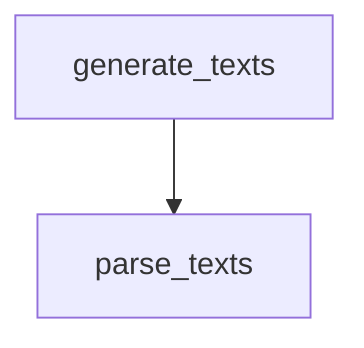
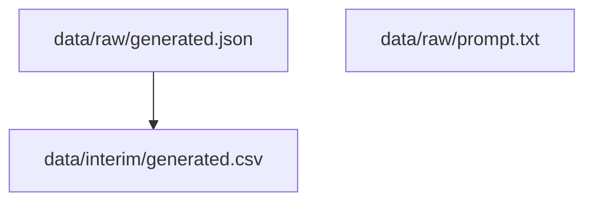

## summary

```mermaid
flowchart TD
	node1["generate_texts"]
	node2["parse_texts"]
	node1-->node2
```
## detail

```mermaid
flowchart TD
	node1["data/interim/generated.csv"]
	node2["data/raw/generated.json"]
	node2-->node1
	node3["data/raw/prompt.txt"]
```
